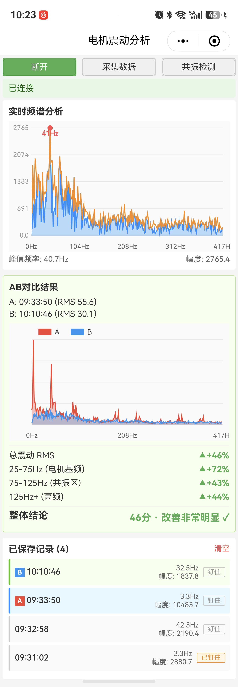

# motor-aed-xiao

> 航模电机震动识别 - Seeed XIAO nRF52840 Sense 固件
>
> 本项目是 [motor-aed-app](https://github.com/xxx/motor-aed-app) 的开源主板端固件。

## 功能
1. 使用 XIAO 主板固定在电机上采集震动数据（BLE 无线发送到手机）。
2. 使用微信小程序：
   - 可视化电机震动情况。
   - 对比电机震动情况，通过优化电机负载（配重）将震动降到最低。
   - 通过油门扫频发现机架共振频率，在飞控上做陷波滤波，优化飞行体验。

## 使用说明

### 1. 准备硬件

1. 用 PlatformIO 编译并烧录固件（见下方「编译」）
2. 将 XIAO 用双面胶或扎带刚性固定在电机安装座 / 机架侧面，尽量靠近震动源
3. 使用 3.7V 锂电池供电

### 2. 连接设备

1. XIAO 上电：板载 LED 快闪数秒后熄灭（等待 BLE 连接）
2. 手机打开「XIAO 震动频谱分析」小程序
3. 点击「连接」，搜索蓝牙设备 `MotorAED-XIAO` 并连接
4. 连接成功后 XIAO LED 常亮，小程序开始实时显示振动频谱

### 3. 实时频谱

- 连接后小程序自动实时绘制 0~416Hz 振动频谱（833Hz 采样的 Nyquist）
- 界面显示当前 RMS 总振动量、峰值频率与幅度
- 启动电机即可看到频谱随转速实时变化

### 4. 采集与保存

1. 飞机带桨上电（进入平时工作状态）、解锁（请注意安全）
2. 通过遥控器或者飞控地面站设定油门到固定值（如 40%）
3. 点击「采集数据」按钮，系统自动采集固定时长数据并保存记录
4. 调整桨叶配重或者电机配重后，在相同油门值下再次采集，作为对比数据

### 5. AB 对比

1. 在已保存记录列表中选择 A 和 B 两条
2. 手机自动计算多项震动指标对比，显示改善率百分比与频谱重叠图
3. 绿色 = 改善（震动降低），红色 = 变差
4. 往复多次，直到电机运行状态最优，**每次对比采集的油门值必须保持一致**

### 6. 共振检测

1. 点击「共振检测」，按弹窗提示确认操作要点
2. 将电机从怠速缓慢、连续、匀速推到满油门（扫频），中途不要停留
3. 手机自动捕捉「频率固定 + 幅度放大」的机架共振峰，找到时手机震动提示
4. 电机共振频率和机架物理特性相关，不会变化，可直接在飞控中配置陷波频率，改进飞控飞行效果。
5. 可测范围约 200~416Hz

## 系统截图



## 微信小程序二维码


## 硬件

- 主控: Seeed XIAO nRF52840 Sense
- IMU: LSM6DS3TR-C (I2C 地址 0x6A)
- BLE: nRF52840 原生 SoftDevice

## 数据传输协议

### BLE GATT 定义

使用标准 Nordic UART Service (NUS):

|  | UUID | 属性 | 方向 |
|------|------|------|------|
| Service | `6E400001-B5A3-F393-E0A9-E50E24DCCA9E` | 服务 | 双向 |
| TX | `6E400003-B5A3-F393-E0A9-E50E24DCCA9E` | Notify | XIAO → 手机 |
| RX | `6E400002-B5A3-F393-E0A9-E50E24DCCA9E` | Write | 手机 → XIAO |

- 广播设备名: `MotorAED-XIAO`

### 数据流格式

通过 TX Notify 发送**带 SEQ 序号的批量包**（协议见固件头注释 `[SEQ:1] + [X_L,X_H,Y_L,Y_H,Z_L,Z_H] * N`）：

- 每包 = `[SEQ:1字节] + [6 个采样点 × 6字节]` = 37 字节
- 每个采样点 6 字节，顺序: X (2B 小端) → Y (2B 小端) → Z (2B 小端)
- 每个轴是 16-bit 补码，对应 LSM6DS3TR-C 原始输出
- `SEQ` 0~255 循环，用于手机端检测丢包

```
| SEQ | X_L X_H Y_L Y_H Z_L Z_H | X_L X_H Y_L Y_H Z_L Z_H | ... (共6个采样点) |
```

### IMU 配置

- 加速度 ODR: 833 Hz
- 加速度量程: ±2 g
- 转换为物理量: m/s² = count / 16384 * 9.80665

### 发送策略

- 每包批量读取 6 个采样点（I2C 地址自增一次连续读 6 字节），整包一次 Notify 发送
- `configPrphBandwidth(BANDWIDTH_MAX)` 开启 DLE（MTU=247），单通知装下 37 字节
- 精确节奏延时保持 833Hz（每包周期 ≈ 7203µs）；BLE FIFO 满导致短写时丢弃本包、不递增 SEQ

### LED 指示灯

| LED 状态 | 含义 |
|----------|------|
| 常亮 | BLE 已连接，正在发送数据 |
| 熄灭 | 等待 BLE 连接 / 未连接 |
| 快闪 (~5Hz) | 开机等待串口，或 IMU 初始化失败 |

## 编译

本项目使用 PlatformIO 开发，打开目录就能编译上传:

```bash
pio run --target upload
```

## 配置

配置都在 `platformio.ini`，默认已经配置好 Seeed XIAO nRF52840 Sense，直接使用。

## 协议

MIT License
